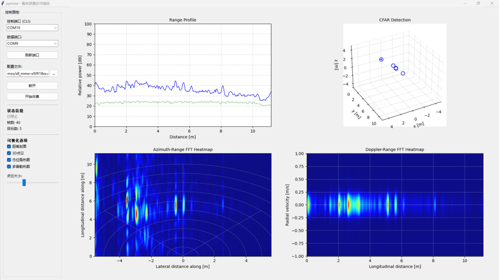

# mmwave-visualizer-python

Python实时可视化工具，用于TI毫米波雷达（IWR1843/IWR6843）



## 功能特性

- **距离谱 (Range Profile)**: 实时显示距离-能量曲线
- **3D点云检测 (CFAR Detection)**: 三维空间目标可视化
- **方位角热图 (Azimuth-Range FFT)**: 极坐标空间映射
- **多普勒热图 (Doppler-Range FFT)**: 距离-速度分布

## 硬件要求

- TI IWR1843BOOST / IWR6843ISK 雷达模块
- XDS110 调试器（或集成调试器）
- USB 连接线

## 安装依赖

```bash
pip install pyserial numpy matplotlib scipy
```

## 使用方法

1. 连接雷达并确认串口号
2. 进入source目录运行：

```bash
cd source
python pymmw_gui.py
```

3. 在GUI中选择串口和配置文件，点击"刷新"和"开始采集"

## 配置文件

位于 `source/mss/` 目录下，支持多种雷达型号：
- `x8_mmw-xWR18xx.cfg` - IWR1843配置
- `x8_mmw-xWR68xx.cfg` - IWR6843配置

## 项目结构

```
mmwave_gui/
├── source/
│   ├── pymmw_gui.py      # 主GUI程序
│   ├── pymmw.py          # 命令行入口
│   ├── app/              # 可视化模块
│   ├── lib/              # 工具库
│   └── mss/              # 雷达驱动和配置
└── docs/
    └── screenshot.png    # 运行截图
```

## License

MIT License
